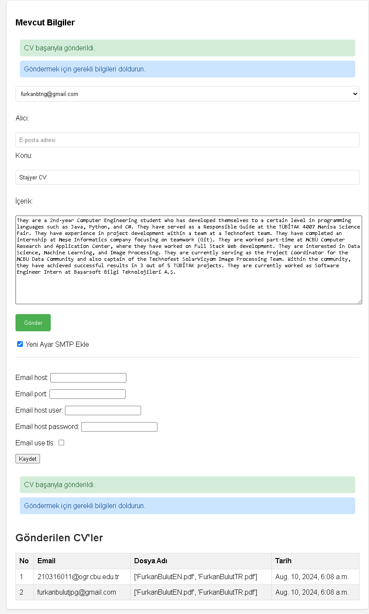

# Django Email Automation Module

This Django module is designed to automate the process of sending emails with attachments using specified SMTP settings. It allows you to send emails to a template address with attachments according to the provided SMTP information.

## Features

- **Multiple SMTP Configurations**: You can input multiple SMTP settings to send the same email from different accounts.
- **Record Keeping**: All sent emails are recorded, preventing duplicate sends to the same account.
- **TLS Support**: The module operates seamlessly with TLS settings for secure email transmission.
- **Local Database Integration**: Operations are tracked in a local database, simplifying the CV sending process and maintaining records of sent applications.

## Demo

Here is a screenshot demonstrating the functionality of the email automation module:



## Usage

I used this project during my internship search to send CVs and keep track of the companies I contacted. The module streamlines the CV submission process and ensures that all interactions are logged for future reference.

## Setup

1. **Install Django**: Ensure you have Django installed in your environment. If not, you can install it using:
   ```bash
   pip install django
   ```

2. **Apply Migrations**: Run the migrations to set up the database schema:
   ```bash
   python manage.py migrate
   ```

3. **Run the Server**: Start the Django development server:
   ```bash
   python manage.py runserver
   ```

This will set up and run the Django project, making the email automation module ready for use.
